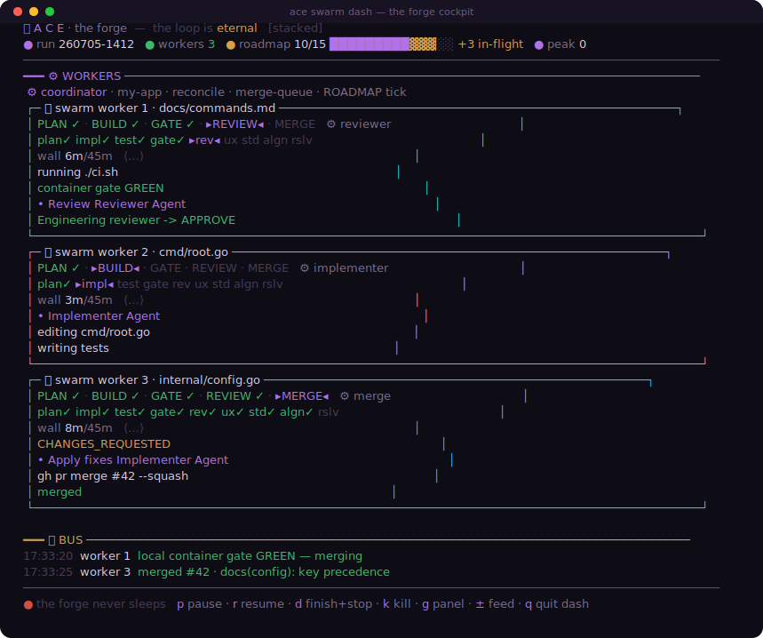
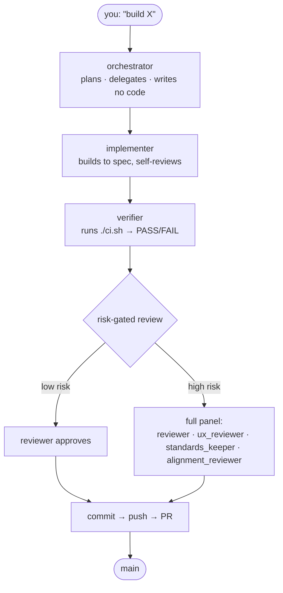
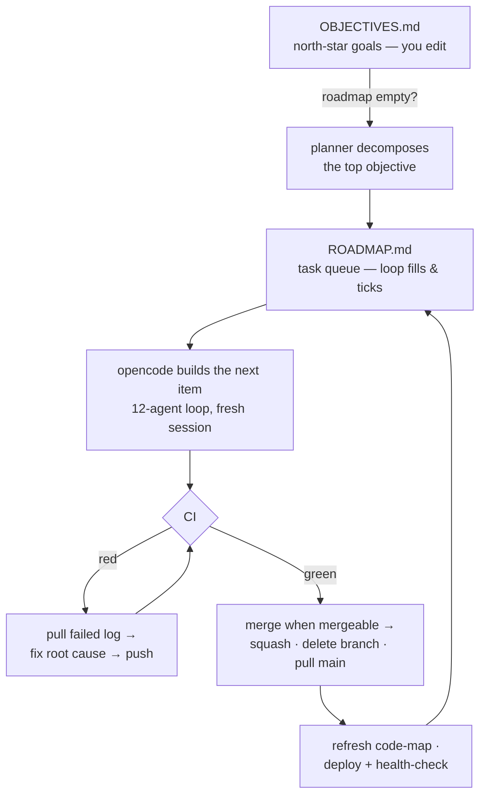

<div align="center">

# ACE — Agentic Coding Environment

**A one-command rig that installs a self-driving build loop.** You set the objectives; a 12-agent crew plans, builds, tests, reviews, merges, and deploys — unattended — grounded by MCP servers so it doesn't hallucinate your codebase.

`OpenCode` + `DeepSeek V4` · 12-agent crew · self-healing CI · limit-resilient autonomous PR runner
Runs on **Fedora Silverblue / Arch** · Node · Python · **Go** · everything user-local, no root


<a href="https://github.com/buagi/ace/actions/workflows/ci.yml"></a>
<a href="LICENSE"></a>


</div>

You describe the goal. The crew branches, builds, tests, reviews itself across up to four independent critics, fixes its own failing CI from the logs, merges when everything is green, deploys, and pulls the next item from the board — until your objectives are met.

## Demo

<div align="center">

**The autorun loop, in motion**


**The swarm — parallel workers, one cockpit**

[](docs/demo/swarm-full-recording.html)

</div>

Run N feature-streams at once, each in its own worktree, self-merging. `ace autorun` → pick 2–8, or `ace swarm start`. See [docs/swarm.md](docs/swarm.md).

## Quickstart

```bash
# 1. clone + put it on PATH
git clone https://github.com/buagi/ace ace && cd ace
ln -s "$PWD/ace" ~/.local/bin/ace      # `ace` now works anywhere

# 2. wire the rig (host tools + API key + agent config + GitHub login)
ace install

# 3. NEW build → `ace scaffold`   |   EXISTING repo → `cd my-repo && ace upgrade`

# 4. go hands-off
cd <project>
$EDITOR OBJECTIVES.md                  # set the north-star goals
ace autorun                            # the loop takes over
```

`ace status` confirms the rig is green. `ace --help` lists every command. `--dry-run` previews any command without changing anything.

> [!TIP]
> **Try it in ~2 minutes — $0, no keys, nothing installed.** `ace demo` (paced tour of every feature — `DEMO_AUTO=1` to auto-advance) · `ace loop dash --demo` (scripted preview) · `ace swarm sandbox` (live dry-run demo) · or add `--dry-run` to any command. Nothing is built, pushed, or spent. Recording a video? See [docs/demo/RECORDING.md](docs/demo/RECORDING.md).

> [!NOTE]
> **No Claude subscription required.** The overseer *defaults* to Claude Opus, but ACE runs end-to-end on a cheap DeepSeek API key alone — `ace keys --brain deepseek`. The 10 worker agents are always DeepSeek, so the crew is low-cost by design.

## What it is

A self-driving build loop. One orchestrator plans and delegates; nine specialist subagents do the work and judge it. The orchestrator writes no code — it plans, delegates, and drives the loop to a complete result.



| Agent | Role |
|-------|------|
| **orchestrator** | Plans into small tasks, delegates, drives the loop. Writes no code. |
| **implementer** | Builds one scoped task to production quality; self-reviews before returning. |
| **test_engineer** | *(high-risk only)* Authors independent, adversarial tests that try to break the code. |
| **verifier** | Runs `./ci.sh`, re-reads the diff, confirms cited symbols exist → PASS/FAIL. |
| **reviewer** | Principal-engineer code critic: correctness, integration, placement, security. |
| **ux_reviewer** | *(high-risk)* Product/UX & scope critic. |
| **standards_keeper** | *(high-risk)* Best-practices vs `.opencode/STANDARDS.md`; flags EOL/version drift. |
| **alignment_reviewer** | *(high-risk)* Judges the change against the project's mission/values/audience. |
| **conflict_resolver** | Wakes only on a PR conflict; reconciles *both* sides (never `--ours/--theirs`, never reverts). |
| **launch_readiness_reviewer** | Runs *once* before a live promotion — verifies restore/rollback/secrets/spend caps. |

The commit gate is strict: a commit lands only on **verifier PASS** *and* the risk-gated critics' **APPROVE**. The script merges the PR — the agent never self-merges.

### Grounding

ACE is grounded by three MCP servers so it doesn't hallucinate structure or versions:

| Server | Grounds against |
|--------|-----------------|
| **GitNexus** | the code graph — impact analysis, execution flows, symbol connections |
| **Serena** | live symbols — every definition and usage |
| **Context7** | live library docs |

The `standards_keeper` also checks the live web (`endoflife.date`, official release pages) for current LTS/EOL and latest-stable facts, then flags anything past-EOL or >1 major behind — cached to `.opencode/cache/versions.json` (~7-day TTL) so it reads a file instead of re-fetching each review.

## The autorun loop

`ace autorun` chains the whole pipeline and runs unattended.



| Stage | What happens |
|-------|--------------|
| **Plan** | When the roadmap is empty, the planner breaks the top `OBJECTIVES.md` goal into `ROADMAP.md` tasks. |
| **Build** | A fresh opencode session builds the next item through the 12-agent loop. |
| **Gate** | `./ci.sh` must pass; a red CI is self-fixed from the failed-job log (root cause, no band-aids). |
| **Merge** | When all checks are green and the PR is mergeable: squash-merge, delete the branch, pull `main`. |
| **Deploy** | Refresh the code map, then deploy + health-check (CI job, or `DEPLOY=1`), then take the next item — until `MAX_FEATURES`. |

The loop keeps two files in sync: **`OBJECTIVES.md`** (north star — you edit) and **`ROADMAP.md`** (concrete queue — the loop fills and ticks). Progress marks its way back up the chain.

### How it stays correct and resilient

The loop is built to protect `main` and survive limits, stalls, and crashes. Highlights (full detail in [docs/autorun.md](docs/autorun.md)):

| Area | What it does |
|------|--------------|
| **Risk-scaled review** | Classifies each change: low-risk (docs/config/single non-security package) gets a fast lane; high-risk (auth · money · migrations · secrets · public APIs · multi-package) gets the full 4-critic panel + security hard gate. Unsure → treated as high-risk. |
| **Preflight** | Confirms the right repo + branch and that any pending PR belongs to *this* `repo:branch` before acting (optional `EXPECT_REPO` hard-guard). |
| **Conflict resolution** | On a PR conflict, `conflict_resolver` merges `main` in and preserves *both* intents; a reviewer confirms nothing was lost, else it's sent back. Genuinely incompatible → escalates rather than guessing. |
| **Safe self-merge** | Merges only when every check is green *and* the PR is open, current, and mergeable — otherwise it stops for you. |
| **Self-healing CI** | Fixes red CI from `gh run --log-failed` at the root cause. Distinguishes a *blocked* CI (0 jobs executed — billing/outage) from a broken one and, with `LOCAL_CI_FALLBACK=1`, vouches via the local container gate to keep flowing. |
| **Limit-resilient** | On an overseer rate-limit it waits and resumes on *your* model (never silently downgrading); opt into `ON_CLAUDE_LIMIT=deepseek` to keep going. Workers stay on DeepSeek throughout. |
| **Clean stop** | Ctrl-C tears down the whole subtree — the in-flight opencode, its MCP servers, any podman build, the watchdog — so nothing is orphaned. |
| **Observability** | Every step appends a row to `.opencode/metrics.csv` (agent · label · wall · active-think · build seconds · rc). Per-run token/cost via `ace stats`. |
| **Housekeeping** | A throttled janitor reconciles git/GitNexus/opencode/podman drift each few laps; `ace consistency [fix]` runs it on demand. |

## Remote control

A running loop rarely needs babysitting, but you can watch and steer it from chat (Signal / Telegram / Discord — any [Hermes](https://hermes-agent.org/) channel). All layers are opt-in and fail-soft (no `hermes` → silent no-op).

| Layer | Command | What you get |
|-------|---------|--------------|
| **Notify** | `HERMES_NOTIFY=1 ace autorun` | milestone events (started · merged · deployed · CI-red · stopped) texted to you |
| **Command-back** | `ace hermes` → enable | text `ace loop status` / `restart` / `tail the log`; the bot runs it on the host, locked to your id |
| **Approve from chat** | `MERGE_APPROVAL=hermes` | the loop pauses before every merge and waits for `ace approve <tok> yes` — a **deny-by-default** human gate: only an explicit approval word merges, anything unrecognised denies, and a missing decision is an error ([details](docs/remote-control.md#approve-merges-from-chat-human-in-the-loop)) |
| **Ground the agent** | `ace hermes mcp` | chat code questions answered from *your* code (Serena/GitNexus), not guessed |
| **Schedule** | `ace schedule '0 9 * * 1-5'` | a recurring autorun via Hermes cron + an idle-silent status digest |
| **Run as a service** | `ace loop start\|stop\|status\|logs` | the loop as a detached systemd user service, surviving terminal-close + sleep |
| **Watch live** | `ace loop dash` · `ace swarm dash` | a full-screen dashboard over the loop's files |

> [!WARNING]
> Command-back gives the bot a host shell, so the allowlist that locks it to you is mandatory — `ace hermes` sets it up.

Full reference: [docs/hermes.md](docs/hermes.md) · the away-from-keyboard runbook + security model: [docs/remote-control.md](docs/remote-control.md).

## Commands, the gate, and config

| Topic | Where |
|-------|-------|
| Every `ace` subcommand | [docs/commands.md](docs/commands.md) |
| Runbooks for common jobs | [docs/scenarios.md](docs/scenarios.md) |
| The tiered `ci.sh` gate | [docs/the-gate.md](docs/the-gate.md) |
| Every env knob + config location | [docs/configuration.md](docs/configuration.md) |
| Full docs index | [docs/README.md](docs/README.md) |

Global flags: `--dry-run` · `--watch` · `--version` · `--help`.

> [!IMPORTANT]
> Run `ace` from **inside the project repo** — that is how it resolves which repo and branch it acts on.

## Quirks — read these, save yourself an hour

| Quirk | Detail |
|-------|--------|
| **Restart opencode after config changes** | It loads config and `AGENTS.md` at launch, not live. |
| **New terminal after `ace install`** | It adds a `~/.bashrc` block; `~/.local/bin` must be on `PATH` for the `ace` symlink. |
| **DeepSeek runs the crew** | All 9 subagents are DeepSeek V4. The overseer defaults to Claude Opus and is switchable via `ace keys` → `opus` · `sonnet` · `gpt` · `deepseek`. Claude/OpenAI brains need `opencode auth login`. |
| **Secrets never go in git** | Real values live in the VPS `.env` (gitignored); `env-merge` adds new keys on deploy without clobbering. CI builds with dummies. |
| **Branch protection needs GitHub Pro** on private repos | `ace protect` detects the 403; local hooks (`main-guard`, the gate) enforce flow meanwhile. |
| **Container engine required** | podman ships on Silverblue; on Arch, `ace` offers `pacman -S podman`. The `--container` gate needs it. |
| **`gh` must be authed** | `ace git` — push, PRs, CI-watch, and autorun all run through it. |

## Requirements

`bash` · `git` · `curl`. Everything else (`fnm`/node · `uv`/uvx · `bun` · `jq` · `opencode` · `gh`) is installed **user-local** by `ace install`. You also need a **container engine** (podman/docker) for the parity gate and a **DeepSeek** API key (Context7 optional). The default overseer is Claude Opus, so a Claude Pro/Max subscription (`opencode auth login`) is needed unless you select the `deepseek` brain. Tested on Fedora Silverblue/Kinoite and Arch.

## Disclaimer — use at your own risk

> [!CAUTION]
> **ACE is an autonomous agent. It acts on your machines and accounts without asking.** It runs shell commands, edits and deletes files, commits and `git push`es, opens and merges PRs, builds and runs containers, deploys to remote servers over SSH, and spends money (LLM API credits and any host you point it at). It can make mistakes, act on a flawed plan, ship a bug, break a deployment, leak a secret you left in reach, or incur cost — autonomously and unattended.

**By running ACE you accept full and sole responsibility for everything it does on your behalf.** The software is provided **"AS IS", without warranty of any kind** (see [LICENSE](LICENSE)). To the maximum extent permitted by law, the author and contributors are **not liable** for any damage, data loss, downtime, security incident, financial cost, or other harm arising from its use — whether or not foreseeable.

You are responsible for **where and how you run it**: keep backups, use a sandbox / disposable environment / non-production accounts where possible, set spend limits on every paid API and host, scope credentials to least privilege, and review what it ships. Do not run ACE on systems or data you cannot afford to have modified or lost. Running ACE against third parties' systems, or in a way that breaks a provider's terms or the law, is on you.

*This is not legal advice. If protection matters — especially before commercial use — have a lawyer review your situation.*

## License

[GNU AGPL-3.0](LICENSE) © 2026 buagi. Copyleft: you may use, modify, and redistribute ACE, but any version you **distribute or run as a network service** must be released under the AGPL with its complete source (the network-use clause, §13). No warranty; no liability — see the Disclaimer above.
