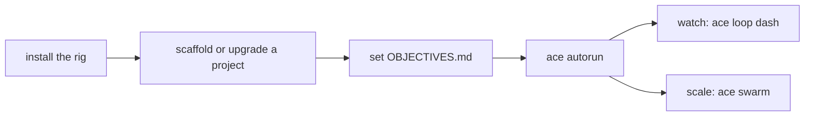

# ACE — Documentation

The full guide, grouped by task. New here? Read the [root README](../README.md) for the overview and quickstart, then use the tables below.

## Start here

| Step | Page |
|------|------|
| 1. Install the rig | [getting-started.md](getting-started.md) |
| 2. Start a project | [stacks.md](stacks.md) · [go-stack.md](go-stack.md) |
| 3. Set delivery policy | [profile.md](profile.md) |
| 4. Run it hands-off | [autorun.md](autorun.md) |
| 5. Scale to parallel | [swarm.md](swarm.md) |

## Setup & build

| Page | What's in it |
|------|--------------|
| [getting-started.md](getting-started.md) | Install, first project, choosing the overseer brain. |
| [stacks.md](stacks.md) | The scaffoldable stacks (Node · Python · Go · Config) **and how to add a new one**. |
| [go-stack.md](go-stack.md) | The Go route: architecture profile wizard, gopls MCP, hardened release binaries. |
| [profile.md](profile.md) | The editable project profile (`.opencode/profile.yaml`) and delivery policy (merge gate / auto-accept). |

## Run it

| Page | What's in it |
|------|--------------|
| [autorun.md](autorun.md) | The autonomous loop — lifecycle, per-run metrics, the read-only ACE self-triage. |
| [the-gate.md](the-gate.md) | The tiered `ci.sh` gate — what blocks a commit. |
| [deploy.md](deploy.md) | Shipping to the VPS — cadence, the `DEPLOY_GATE` milestone gate, manual deploy, where to check what's live. |
| [agents.md](agents.md) | The 10-agent crew, risk-gated review, and the alignment critic. |

## Run it in parallel

| Page | What's in it |
|------|--------------|
| [swarm.md](swarm.md) | Parallel loops — N workers in path-disjoint worktrees, the live cockpit (`ace swarm dash`), finish+stop, per-run archives, every `SWARM_*` knob. |
| [observability.md](observability.md) | Watching a run & reading the logs — the live dash, the bus events, the full log/artifact map, and `jq` recipes for "what happened / why". |
| [conflict-policy.md](conflict-policy.md) | How the swarm handles *predictable* merge conflicts up front (version · changelog · lockfiles · manifests). |

## Drive it remotely

| Page | What's in it |
|------|--------------|
| [hermes.md](hermes.md) | Drive ACE from chat — notify · approve · schedule · ground · kanban · brain · dashboard, on any channel. |
| [remote-control.md](remote-control.md) | The away-from-keyboard runbook — detached service, staying reachable, the security model. |

## Reference

| Page | What's in it |
|------|--------------|
| [commands.md](commands.md) | Every `ace` subcommand. |
| [configuration.md](configuration.md) | Every env knob and where config lives — the settings reference. |
| [scenarios.md](scenarios.md) | Runbooks for the jobs you'll actually run. |
| [deferred-decisions.md](deferred-decisions.md) | *(maintainer)* Known trade-offs intentionally not built yet, and their triggers. |
