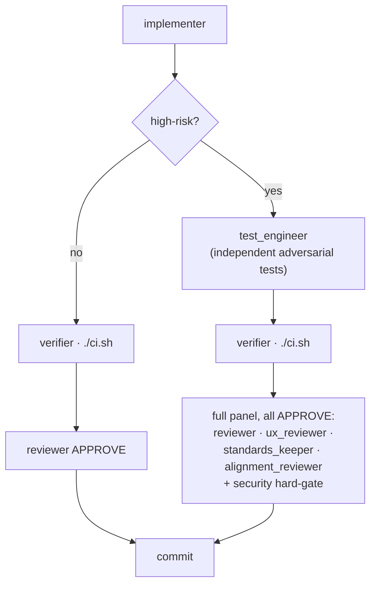

# Agents

ACE builds every feature with a fixed set of 12 agents: one **orchestrator** that plans and delegates, plus eleven subagents it calls to research, implement, test, review, and debate the work. The config is written to `~/.config/opencode/opencode.json` by `ace install` / `ace opencode`.

The orchestrator runs on your chosen overseer brain and writes no code — it plans, delegates, and drives the loop. The subagents default to DeepSeek V4; any can be pointed at another provider with `MODEL_<agent>=<provider>/<model>` (e.g. the `cross-review` preset puts the critics on OpenRouter).

## The roster

| Agent | Runs | Role |
|-------|------|------|
| `orchestrator` | every run | Plans into small tasks, delegates, drives the loop. Writes no code. Reads the [profile](profile.md) and routes work to serve the mission. |
| `researcher` | before a high-risk / `[value]` feature | Read-only research & spec agent. Explores docs + the repo in a *fresh* context and returns the filled `.opencode/spec-template.md` body — keeping the expensive orchestrator context clean. Never writes, edits, or spawns subagents. |
| `implementer` | every task | Senior implementation specialist. Executes one scoped task to production quality (tests included); self-reviews before returning. |
| `test_engineer` | high-risk / logic-dense tasks | Adversarial test author. Designs the test strategy and writes independent tests that try to break the code. Test files + shared helpers only — never production code. |
| `verifier` | every task | Read-only. Runs `./ci.sh`, re-reads the diff, confirms cited symbols exist, runs a security scan → PASS/FAIL. |
| `reviewer` | every task | Principal-engineer code critic: correctness, integration, placement, security hard-gate. |
| `ux_reviewer` | high-risk tasks | Product/UX & scope critic — judges as a demanding end user; weighs DX/API ergonomics. |
| `standards_keeper` | high-risk tasks | Best-practices critic. Curates `.opencode/STANDARDS.md` for the stack; flags version drift and past-EOL deps. |
| `alignment_reviewer` | every task (planner) + high-risk (critic) | Mission/values/audience critic — judges whether a change serves the [profile](profile.md). |
| `conflict_resolver` | on a merge conflict | Resolves a PR's conflicts by preserving both sides' intent; escalates UNRESOLVABLE. |
| `launch_readiness_reviewer` | once, before a live promotion | Operational-readiness gate. Verifies a tested restore, rollback, secrets separation, and spend caps → GO / NO-GO. |
| `debater` | opt-in (`SPEC_DEBATE` / `REVIEW_DEBATE`), high-risk | Read-only side of a cross-model **debate** — one instance runs on your overseer (defender), one on an OpenRouter model (challenger), pressure-testing a spec or diff until they converge on the issues both accept. Default off; calibrate first. |

**One spec, shared by the crew.** For a `[value]` feature the planner writes a single canonical spec to `.opencode/specs/<slug>.md` (filling `.opencode/spec-template.md`) — delegating the drafting to the read-only `researcher` on heavy/high-risk features so the research cost lands in a throwaway context, not the orchestrator's. It's the load-bearing artifact: the **implementer** reads it by path (§3-Out bounds scope, its increment's `AC:` ids are the Definition-of-Done, §C1 contract shapes are law), and the **test_engineer**, **reviewer**, and **verifier** read the same file — so acceptance criteria and cited integration points are one shared vocabulary, not re-derived per agent. A per-task "spec" is a *slice* of that one file (scope + the increment's ACs), never a second document. See [autorun.md → Feature specs](autorun.md#feature-specs--the-research-first-artifact).

> [!NOTE]
> `launch_readiness_reviewer` is the one agent that does not run per feature. It runs a single time before a change is promoted to the live VPS.

## Overseer brain

The orchestrator's model is your choice; the eleven subagents default to DeepSeek V4 (any can be repointed per `MODEL_<agent>`).

| Brain | Model id | Needs |
|-------|----------|-------|
| Claude Opus ✓ default | `anthropic/claude-opus-4-8` | a Claude Pro/Max plan |
| Claude Sonnet | `anthropic/claude-sonnet-4-6` | a Claude Pro/Max plan — lighter quota, good for long autoruns |
| OpenAI GPT-5 | `openai/gpt-5` | a ChatGPT login or `OPENAI_API_KEY` |
| DeepSeek | `deepseek/deepseek-v4-pro` | no subscription |

Pick the brain in `ace keys` (it sets `ORCH_PROVIDER`), or override the model directly with `MODEL_orchestrator`.

## Risk-gated review

The orchestrator scales review ceremony to the change. Low-risk work takes a fast lane; high-risk work gets an independent test pass and the full critic panel.

| Risk tier | Triggers | Test pass | Critics that must APPROVE |
|-----------|----------|-----------|---------------------------|
| **Low** | docs/config/copy · test-only · a single non-security package | implementer's own tests | `reviewer` |
| **High** | auth · money/orders/webhooks · DB migrations · secrets · public APIs · multi-package (when unsure, treat as high) | `test_engineer` adds independent tests | `reviewer` + `ux_reviewer` + `standards_keeper` + `alignment_reviewer`, plus the security hard-gate |

A commit lands only on **verifier PASS** and the required critics' **APPROVE**. The loop never self-merges unsafely: it pushes a branch, opens a PR, and merges only when the [delivery gate](profile.md#delivery-policy--loop-behavior) is green.

> [!NOTE]
> When the profile sets `auto_merge: true` (the loop self-merges with no human gate) and the audience is `oss-public`, `end-customer`, or `enterprise`, there is no low-risk fast lane — every change is treated as high-risk.

## The alignment critic

`alignment_reviewer` judges a change against the project [profile](profile.md) — `.opencode/profile.yaml` + `ARCHITECTURE.md` — exactly as `standards_keeper`'s source of truth is `STANDARDS.md`. It acts in two ways:

| Mode | When | What it does |
|------|------|--------------|
| Planner-level | always | The orchestrator reads the profile first and routes every task to serve the stated mission and audience, flagging off-mission work. |
| Dedicated critic | high-impact / user-facing changes | Gives a focused verdict — does this advance the mission, fit the audience, uphold the values/philosophy, and suit the throughput target? — as `APPROVE` / `CHANGES_REQUESTED` tied to specific profile fields. |

If no profile exists, it says so and approves on scope-fit only — it never blocks on a missing profile.

## The test engineer

The implementer already writes tests as part of its Definition of Done, but it tests its own code, so those tests can carry the same blind spots. On **high-risk or logic-dense** tasks — the same gate that triggers the full critic panel — the orchestrator adds an independent `test_engineer` pass: a specialist that authors tests against the implementer's mental model, trying to break the code rather than confirm it.

- It writes test files and shared helpers only — never production code.
- If a test exposes a bug, it reports it for the implementer to fix rather than papering over it.
- Low-risk tasks skip it and rely on the implementer's own tests, so the extra cost only lands where it pays off.

It picks the test type per scenario from the decision table in `.opencode/STANDARDS.md` (curated by `standards_keeper`), mirrored in every project's `AGENTS.md`:

| Code under test | Test type |
|-----------------|-----------|
| Branchy logic, boundaries | Table-driven (happy + error + edge) |
| Parser / serializer / encoder / math | Property + fuzz (roundtrip & invariants) |
| Generated output | Golden / snapshot |
| HTTP / RPC handler | In-process server + contract check |
| DB / external wiring | Integration against an ephemeral dependency |
| Money / orders / webhooks | Replay/idempotency + audit-record assertion |
| Auth / ownership | Authz-DENY matrix (role × resource) |
| Concurrency | Race detector + contention cases |
| Critical user flow | One end-to-end test, sparingly |

Scaffolded projects ship a shared test-support module to reuse:

| Stack | Module | Includes |
|-------|--------|----------|
| Go | `internal/testutil` | a FakeClock + golden helper |
| Node | `tests/` | factories + helpers |
| Python | `tests/conftest.py` | fixtures |

`./ci.sh` reports **coverage of the changed code** as a signal — there is no blanket-percentage gate, which just invites gaming. High-stakes packages can be mutation-tested (`scripts/mutation.sh`) for a stronger signal than coverage. Tests always ship in the **same PR** as the code they cover.

> [!IMPORTANT]
> After editing the agent config in `lib/install.sh`, run `ace opencode` to regenerate the live config, then restart opencode — it loads config at launch.

## See also

- [autorun.md](autorun.md) — the loop these agents drive
- [the-gate.md](the-gate.md) — `./ci.sh`, the check the `verifier` runs
- [profile.md](profile.md) — the mission/values the `alignment_reviewer` enforces
- [configuration.md](configuration.md) — overseer brain, per-agent model overrides, and other knobs
