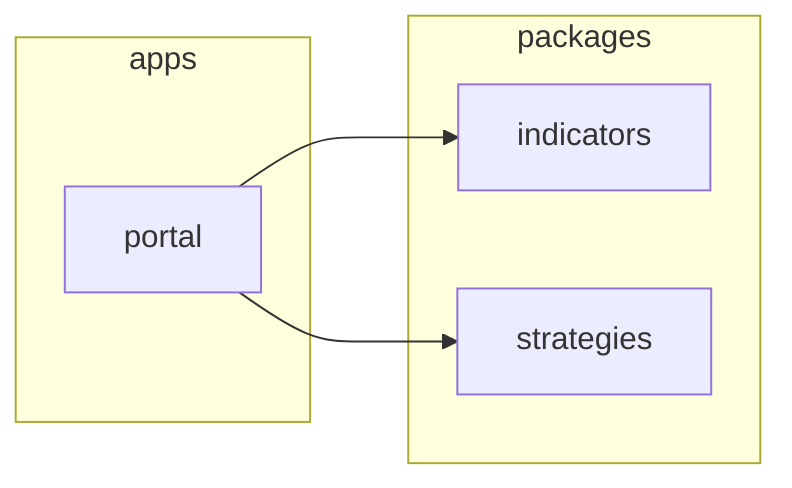

# The Architecture Atlas — how the diagrams are made

ACE keeps a **human-readable map of your project's architecture** up to date automatically. It's a set of Mermaid diagrams generated from your real code — not hand-drawn, not LLM-guessed — so it never goes stale or lies.

This page explains what it produces, where it lands, how it's built, and when it refreshes.

---

## What it produces — three views

Every atlas has the same three sections, written to **`docs/atlas.md`**:

| View | What it shows | Diagram |
|------|---------------|---------|
| **System map** | every workspace/module and the **real internal dependencies** between them, grouped by layer (`apps` / `packages` / `services` / …) | Mermaid `flowchart` |
| **Data flow** | the same graph aggregated to **layers**, showing the direction work flows through the system | Mermaid `flowchart` |
| **Module map** | a table — each module's **layer, role, what uses it, and what it depends on** | Markdown table |

A trimmed **System map** looks like this (real output):

---

## Where it's written

| Location | What |
|----------|------|
| **`docs/atlas.md`** | the full atlas — all three views. Header says *"Generated — do not edit by hand."* |
| **`README.md`** | an inline **system-map block** between the sentinels `<!-- ace:atlas:start -->` and `<!-- ace:atlas:end -->`, so the map is the first thing a visitor sees. Only the region between the sentinels is touched; the rest of your README is left alone. |

> [!WARNING]
> **Don't hand-edit `docs/atlas.md` or the README block between the sentinels** — they're regenerated and your edits will be overwritten. Change the *code* (or the module `Role`, if you use narrative mode) and let it rebuild.

---

## How it's built — deterministic, zero tokens

The generator is a per-project script, **`scripts/atlas-refresh.sh`**, that ACE writes into your repo. It does **not** call an LLM by default — it reads facts straight from your codebase:

1. **Find the workspaces** — `git ls-files 'package.json' '**/package.json'` (tracked manifests only; `node_modules` excluded).
2. **Build the dependency graph** — for each `package.json`, read its name and its **internal** dependencies (workspace `@scope/*` packages), producing a name → deps map.
3. **Render the three views** — one pass turns that graph into the System map (subgraph per layer + internal edges), the Data flow (layer aggregation + direction), and the Module map (the table).
4. **Fallback** — a repo that isn't a JS/TS workspace falls back to mapping its **source directories** (`.ts/.py/.go/.rs/.java/…`) instead, so you still get a map.

Because it's derived from `git ls-files`, only **committed** files appear — the map reflects what's actually in the repo, not scratch work.

> [!NOTE]
> **Optional richer roles.** With `ATLAS_NARRATIVE=1`, a single read-only "cartographer" agent pass fills the **Role** column of the Module map with a grounded phrase per module (using `ATLAS_AGENT`). Off by default → the skeleton is pure, deterministic, and free.

---

## When it refreshes

| Trigger | Behaviour |
|---------|-----------|
| **On demand** — `ace atlas` | rebuilds now (forces past the skip checks). Use it any time you want a fresh map. |
| **During a loop run** | refreshed every **`MAP_EVERY`** merged features (default 3) — never per-commit. |
| **In a swarm worker** | **never** — workers skip atlas generation so parallel PRs don't churn the same file. The coordinator/loop owns it. |
| **Nothing changed** | if the dependency signature is unchanged since the last build, it **skips** (no empty commit). `ace atlas` overrides this. |

---

## Config knobs

Set in the environment or `~/.config/ace/config.env`.

| Var | Default | What it does |
|-----|---------|--------------|
| `ATLAS` | `1` | `0` disables atlas generation entirely (the generator exits immediately). |
| `MAP_EVERY` | `3` | refresh every N merged features in the loop. |
| `ATLAS_FORCE` | `0` | `1` overrides the swarm-worker skip and the unchanged-signature skip (this is what `ace atlas` sets). |
| `ATLAS_NARRATIVE` | `0` | `1` adds the grounded Role narrative (one read-only agent pass). |
| `ATLAS_AGENT` | *cartographer* | which agent runs the narrative pass when it's on. |

---

## Two maps, don't confuse them

ACE keeps **two** different maps, for two different readers:

| File | For | Made by |
|------|-----|---------|
| **`docs/atlas.md`** | **humans** — the visual architecture overview described here | `scripts/atlas-refresh.sh` (`ace atlas`) |
| **`docs/architecture.md`** | **the agents** — a code graph for impact analysis / navigation | GitNexus / Serena (`ace graph`) |

If you want "how does this system fit together," read `docs/atlas.md`. If an agent needs "what calls this function," that's the `ace graph` code map.

---

## Rendering & keeping the generator current

- **Rendering** — the diagrams are standard Mermaid; GitHub renders them inline in `docs/atlas.md` and the README, as does any Mermaid-aware viewer. No build step, no images to commit.
- **Updating the generator** — `scripts/atlas-refresh.sh` carries an `atlas-gen-version` stamp. When ACE ships a newer generator, **`ace upgrade`** replaces an out-of-date copy in your project (and keeps a current one untouched). See [getting-started.md → Staying current](getting-started.md#staying-current).

---

## See also

- [commands.md](commands.md) — `ace atlas`, `ace graph`
- [configuration.md](configuration.md#architecture-atlas) — the atlas knobs in context
- [observability.md](observability.md) — reading a run's logs (a different kind of "where do I look")
