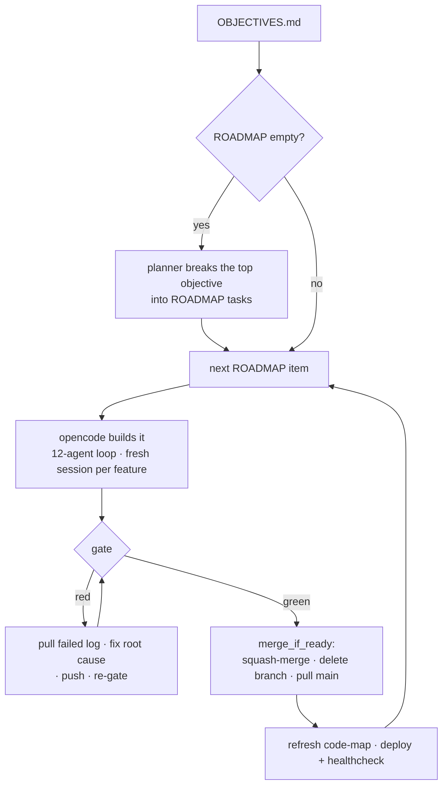

# The autorun loop

`ace autorun` (alias `autoloop`) chains the whole delivery pipeline and runs unattended. It writes `scripts/auto-loop.sh` and drives it.

## The loop



| Step | What happens |
|------|--------------|
| **Plan** | When ROADMAP is empty, the planner breaks the top `OBJECTIVES.md` objective into ROADMAP tasks. For a **`[value]` user-facing feature** it does a short **research + design pass first** — webfetches how leading/comparable products implement the pattern + the industry-standard scope, decides the right scope (adopt a better approach, or judge the current one sufficient — no gold-plating), writes a concise design to `.opencode/specs/<slug>.md`, and **decomposes the feature *from that design*** into coherent increments. `[infra]` plumbing skips research (known patterns). The overseer can re-plan/adjust live. |
| **Build** | opencode builds the next ROADMAP item in the 12-agent loop — a fresh session per feature. |
| **Gate** | Push a branch and open a PR, then run the merge gate. Red → pull the failed log, fix the root cause, push, re-gate. |
| **Merge** | On green, `merge_if_ready` squash-merges, deletes the branch, and pulls `main`. |
| **Roll** | Refresh the code-map (and the human [Architecture Atlas](configuration.md#architecture-atlas) every `MAP_EVERY` merges), deploy + healthcheck (when enabled), then take the next item. |

## Feature specs — the research-first artifact

For a `[value]` feature the planner writes **one canonical feature spec** to `.opencode/specs/<slug>.md` by filling **`.opencode/spec-template.md`** (regenerated on every `ace install`/`ace upgrade`; pin local additions in `spec-template.local.md`). The template has seven mandatory sections — Problem · Prior art & approach · Scope (in/out) · Acceptance criteria (EARS, stable `AC-<n>` ids) · Integration (every codebase claim **cited** `(cites path:L..-L..)` from a file that was *opened*, never code-search) · Increments · Open questions — plus conditional blocks (contract, data model, UX, NFR, security, rollback) that are either filled or marked `N/A — <reason>`.

**Two tiers, one file.** The **feature spec** is the single canonical document. A **task/increment "spec" is a *slice* of it** — §3 Scope + that increment's `AC:` ids + the relevant conditional blocks — assembled at dispatch, **never a second file**. Each §6 increment becomes one ROADMAP item carrying `Spec:` + `AC:`; `<slug>.progress.md` remains the resume ledger.

**The quality bar is the regeneration test:** a fresh worker given *only* `.opencode/specs/<slug>.md` must be able to rebuild the feature behaviorally identical. (If the template file is absent, the prompts fall back to an inline outline.)

## The merge gate

What counts as a green gate depends on the [profile](profile.md)'s `merge_gate` (env `MERGE_GATE` overrides):

| `merge_gate` | Authority | Behavior |
|--------------|-----------|----------|
| `remote` ✓ default | GitHub Actions | Wait for Actions to be all-green, then merge. |
| `local` | `./ci.sh --container` | Merge on the VPS-parity build's authority, without waiting on Actions. Still pushes a branch and opens a PR — a local gate is not "no remote". |
| `both` | both | Require a green `./ci.sh --container` **and** green Actions before merging (strictest). On a blocked-Actions lap it stops rather than vouching local-only. |

The loop self-merges only when `auto_merge` / `AUTOMERGE=1`. With `auto_merge: false` / `AUTOMERGE=0` it opens one PR and stops for your review — it does not keep building on the un-merged branch. It never merges a conflicting PR; the `conflict_resolver` agent reconciles both sides first.

> [!IMPORTANT]
> A remote `origin` is required in every mode. `ace autorun` refuses up front with *"no 'origin' remote"* if there isn't one.

## Confirmations — when it pauses

Launched **headless** — `ace autorun --yes`, or any non-TTY launch such as Hermes-over-Telegram — the loop reads its whole policy from the environment, prints it, and auto-starts with no prompts. (`--yes` sets `ACE_YES=1`, which forces headless even under a pty.)

| Env | Default (headless) | Effect |
|-----|--------------------|--------|
| `AUTOMERGE` | profile `auto_merge` | On: self-merge each all-green, mergeable PR with no confirmation, then roll to the next item. Off: open one PR and stop. |
| `MAX_FEATURES` | `3` · `0` for the detached `ace loop` service | Stop after this many merged features (a safety cap). `0` = unlimited. |
| `MAX_PLANS` | `5` | Give up if ROADMAP is still empty after this many planning attempts. |

> [!NOTE]
> The merge is performed by the loop **script** (`merge_if_ready` → `gh pr merge --squash --delete-branch`), never by an agent. That is why the agent prompt can say "never merge your own PR" while self-merge still works.

Even headless, the loop **stops rather than merge** on anything unsafe:

- a conflicting PR with auto-resolve off,
- an empty ROADMAP after `MAX_PLANS`,
- a billing-blocked Actions run — raise the Actions limit, or set `LOCAL_CI_FALLBACK=1` / `merge_gate=local`.

### Human approval per merge

To require a human OK before each merge, launch with `MERGE_APPROVAL=hermes` (the conductor's "ask me before each merge" option). The loop pauses before every merge, pings your chat, and waits for `ace approve <tok> yes`. An explicit deny, a timeout, or no channel leaves the PR open and stops. This is the only thing that inserts a mid-loop confirmation; everything else runs unattended.

> [!NOTE]
> The gate is **deny-by-default**: only an explicit approval word (`yes` `y` `approve` `approved` `ok` `1` `✅`, any casing) merges. An unrecognised reply — including a paraphrase relayed from chat — is recorded as a **deny** with a warning naming the word, and `ace approve` with no decision is an error that records nothing. A failed chat delivery ends the wait immediately instead of burning `APPROVAL_TIMEOUT`. Details: [hermes.md](hermes.md#approvals-from-chat--human-in-the-loop-merges).

> [!NOTE]
> The Hermes conductor still echoes the assembled `ace … --yes` line and asks you to confirm it once before launching — that is the chat skill being deliberate, not ACE blocking. After that, the loop is unattended unless you chose `MERGE_APPROVAL=hermes`.

## Key behaviors

| Behavior | What it does |
|----------|--------------|
| **Preflight** | Confirms the right repo and branch and refuses a stale/wrong PR (`EXPECT_REPO` hard-guard). |
| **Thinks harder** | Agents apply the 3 Whys (root-need) and a pre-mortem ("assume it's live and broke — why?") at implement and review. |
| **Won't rat-hole** | A silent step is judged by a cheap model and bounded. A confirmed rat-hole is auto-fixed a capped number of times (`RATHOLE_RETRIES`, default 2), then the loop stops and files a note. |
| **Budgets active work** | Container builds, installs, and compiles pause the per-step clock; a hard wall ceiling still bounds a truly stuck step. |

All knobs are in [configuration.md](configuration.md).

## Memory & self-improvement

The loop carries forward what it learns so it does not re-solve the same pitfall or re-derive the same facts. This is **context memory** — files the agents read and append, not model weights — and it is per-repo by default.

| Store | Scope | Holds |
|-------|-------|-------|
| `.opencode/lessons.md` | per-repo | Durable decisions and gotchas. The orchestrator reads it before planning and appends one terse, deduped line per lesson after each task (plus a line naming the critic if one gated the change). `compact_lessons` caps it (`LESSONS_MAX_LINES`, 200) and archives the overflow. |
| `.opencode/project-facts.md` | per-repo | Stable facts — stack, key paths, the gate command, the GitNexus `repo:` scoping rule — seeded at bootstrap and appended as the loop learns. |
| `~/.config/ace/host-lessons/<os>.md` | cross-project | Lessons the rat-hole supervisor records, so a host-level trap solved in one repo is avoided in the next. |

Two more mechanisms:

- **Warning dedup** — CI warnings harvested into `ROADMAP.md` are fingerprinted (message only; timestamps and branch stripped), so the same warning is never re-queued.
- **`ace brain`** — an optional bridge that files host + repo lessons into gbrain so they are searchable across everything (brain-first). It is the one built-in way lessons cross project boundaries.

The loop improves its **decisions** through these notes, but it does not rewrite its own source. Fixes to ACE itself come from the self-triage pass below.

## Metrics & post-mortem

Every run is timed, so you can see where the time goes. Two artifacts land in `.opencode/`:

| Artifact | Contents |
|----------|----------|
| `metrics.csv` | One row per phase, tagged with a `run_id` so it is filterable per run. Header: `run_id,ts,branch,event,agent,label,wall_s,active_s,build_s,rc`. |
| `run-summary.txt` | A human post-mortem appended at the end of every run — a clean end or a chat/Ctrl-C stop: wall clock, outcome counts, time-by-phase, and the 5 slowest steps. |

In `metrics.csv`, `wall_s` is the total, `active_s` is thinking time, and `build_s` is slow deterministic work. The `event` column takes these values:

| Event | Row for |
|-------|---------|
| `run_start` | the start of a run |
| `step` | each agent turn |
| `gate` | a CI-authority check (`rc` = green/red) |
| `merge` | a merge |
| `deploy` | a deploy |
| `verify` | a live-deploy verification |
| `janitor` | a cleanup sweep |
| `run` | the closing per-run summary |

```bash
ace loop stats        # print the post-mortems + point at the CSV
column -ts, .opencode/metrics.csv | less -S          # browse raw rows
awk -F, '$1=="<run_id>" && $4=="step"' .opencode/metrics.csv   # one run's agent steps
```

A one-line digest also prints in the loop's run report, and both files are preserved across `ace resume`. Use them to spot the expensive phase — slow builds vs. agent thinking vs. CI waits — and tune the [knobs](configuration.md): `CI_SCOPE`, `OPENCODE_TIMEOUT`, `merge_gate`, `JANITOR_EVERY`.

## ACE self-triage — files an issue, never edits ACE

When the rat-hole supervisor cannot fix a step, it files a note to `~/.config/ace/ace-fixme.log` — something ACE itself (the loop driver) should improve. At the start of `ace autorun`, if such notes exist, it offers to triage ACE first (`FIX_ACE=1`).

This pass is bounded and read-only. It diagnoses the root cause in `lib/*.sh` and files a GitHub issue on ACE's repo (root cause + proposed fix), then archives the note.

> [!IMPORTANT]
> The self-triage pass never edits ACE's code, branches, commits, pushes, or opens a PR — a human reads the issue and changes ACE's `main`. The autonomous loop can improve your project, but it cannot write to ACE itself. The normal project loop still opens PRs in your repo as usual; only ACE's self-triage is issue-only.

## See also

- [agents.md](agents.md) — the 12-agent loop that builds each feature
- [the-gate.md](the-gate.md) — `./ci.sh`, the check behind the merge gate
- [configuration.md](configuration.md) — every knob named here
- [profile.md](profile.md) — `merge_gate`, `auto_merge`, and the delivery policy
