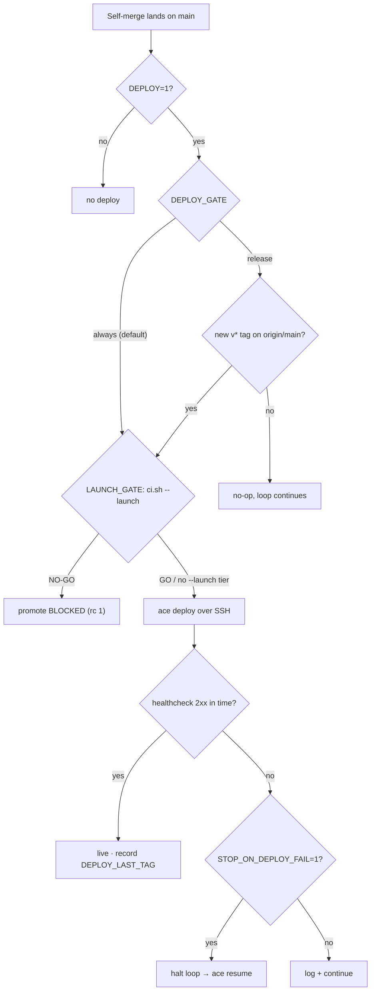

# Deploying

ACE deploys along three independent axes. Keeping them straight is the difference between "why won't it deploy" and "why is it deploying on every merge".

## Three axes

| Axis | Question | Set by |
|------|----------|--------|
| What | is there anything to deploy? | `deploy_kind` (profile) |
| When | how often does it ship? | `DEPLOY` + `DEPLOY_GATE` (env/config) |
| How | what pushes the bits? | in-loop `ace deploy` (SSH) **or** the CI deploy job (git) |

## The per-merge deploy flow

What the loop does after a self-merge lands on `main`:



| Step | Condition | Result |
|------|-----------|--------|
| Merge | a self-merge lands on `main` | the deploy flow begins |
| `DEPLOY` | `0` | no deploy |
| `DEPLOY_GATE` | `always` (default) | deploy now |
| `DEPLOY_GATE` | `release`, no new `v*` tag | no-op, loop continues |
| `DEPLOY_GATE` | `release`, new `v*` tag | deploy now |
| Launch-readiness | `LAUNCH_GATE=1` (default) **and** the project's `ci.sh` has a `--launch` tier | `ci.sh --launch` runs; a NO-GO **blocks the promote** (fail-closed) |
| Launch-readiness | no `ci.sh --launch` tier here | gate is skipped with a warning — nothing is enforced |
| `ace deploy` (SSH) | `git fetch` → `git reset --hard origin/main` → `scripts/deploy.sh` | new bits on the VPS |
| Healthcheck | 2xx within `VPS_HEALTH_TIMEOUT` | mark live, record `DEPLOY_LAST_TAG` |
| Healthcheck fails | `STOP_ON_DEPLOY_FAIL=1` (default) | halt the loop → `ace resume` |
| Healthcheck fails | `STOP_ON_DEPLOY_FAIL=0` | log + continue |

> [!IMPORTANT]
> **The health check gates the record, not the other way round.** `DEPLOY_LAST_TAG` is written only *after* the check passes, so a release that deploys but fails to come up healthy is never marked shipped. That is what makes a retry work: with `DEPLOY_GATE=release`, the next `ace deploy` still sees the tag as undeployed and ships it again, instead of short-circuiting on "already deployed" and leaving the broken version live.

## What — `deploy_kind`

From `.opencode/profile.yaml` (derived from the project shape):

| Kind | Meaning |
|------|---------|
| `service` | a long-running app on a VPS (the deploy path on this page) |
| `artifact` | binaries; they ship on a `v*` tag via the CI **release** job, not a VPS deploy |
| `none` | nothing deployable (a library) |

## When — cadence

The loop's per-merge deploy is controlled by two knobs:

```bash
DEPLOY=1              # run `ace deploy` after each merge (needs deploy_kind=service + a configured VPS)
DEPLOY_GATE=release   # …but only actually ship when origin/main has a NEW v* tag (see below)
```

That gives three regimes:

| Regime | Set | Behavior |
|--------|-----|----------|
| Every merge | `DEPLOY=1`, `DEPLOY_GATE` unset or `always` | full VPS deploy + healthcheck after each self-merge |
| Milestones only | `DEPLOY=1` **and** `DEPLOY_GATE=release` | `ace deploy` still runs every merge, but no-ops unless `origin/main` carries a `v*` tag it hasn't deployed yet |
| Off | `DEPLOY=0` | the loop never deploys; you ship by hand or via CI |

**Every merge** is simple, but every merge blocks the loop on a build + restart. This is usually what "it deploys too often / the loop feels slow" means.

**Milestones only** records the last shipped tag in `~/.config/ace/config` as `DEPLOY_LAST_TAG`. You decide the granularity by *when you tag* — a complete feature, a finished objective section, a major version:

```bash
ace release --tag v1.2.0        # or: git tag v1.2.0 && git push --tags
```

The next `ace deploy` sees the new tag, ships it, and records it. To deploy right now regardless of the gate:

```bash
ace deploy --force              # or: DEPLOY_FORCE=1 ace deploy
```

> [!NOTE]
> `DEPLOY_GATE` resolves env-first, then global ACE config (`DEPLOY_GATE` → stored config → `always`). Because `ace loop start` does *not* capture `DEPLOY_GATE` into `loop.env`, setting it in global config takes effect on the loop's **next** `ace deploy` call — no loop restart needed (the loop shells out to the global `ace` binary).

## The launch-readiness gate — `LAUNCH_GATE`

Before it touches the VPS, `ace deploy` runs the project's `./ci.sh --launch` tier (pre-promotion evidence: tested-restore result, rollback runbook, SLO/runbook presence). It is **fail-closed** — a NO-GO returns non-zero and the deploy never happens, which in-loop counts as a deploy failure and so halts the loop under the default `STOP_ON_DEPLOY_FAIL=1`.

> [!IMPORTANT]
> The gate only bites if the project actually has one. If `ci.sh` is missing or has no `--launch` tier, ACE prints a warning and **proceeds with the deploy** — nothing is verified. Do not read a clean deploy as evidence that readiness was checked; check for the warning, or that `ci.sh --launch` exists. `LAUNCH_GATE=0` disables the gate outright.

## On deploy failure

A failed in-loop `ace deploy` or its healthcheck halts the loop by default (`STOP_ON_DEPLOY_FAIL=1`), so it never keeps building features onto a broken live deploy. Fix the deploy, then `ace resume`.

> [!WARNING]
> Set `STOP_ON_DEPLOY_FAIL=0` to log the failure and keep going instead — e.g. long unattended runs where a transient VPS blip shouldn't halt everything. The trade-off is that the loop will build onto a deploy that may be down.

The **verify** step (`VERIFY=1`) is advisory and never halts.

## How — two transports

Only one of these can break the loop.

### In-loop `ace deploy` (SSH, synchronous)

- SSHes to the VPS: `git fetch && git reset --hard origin/main`, runs `scripts/deploy.sh` (install → build → migrate → restart), then a healthcheck.
- Runs from your machine / the loop host.
- Because it's synchronous, a failure here **halts the loop** by default (`STOP_ON_DEPLOY_FAIL=1`).

### CI deploy job (git-triggered, async)

The `deploy:` job in `.github/workflows/ci.yml` runs in GitHub Actions, fully decoupled from the loop. A failed CI deploy **never breaks the loop** — it just leaves a red run and a stale VPS.

- **Trigger** — push to `main` (`if: github.ref == 'refs/heads/main' && github.event_name == 'push'`).
- **Gate** — the deploy step runs only when the `VPS_HOST` secret is set (`if: env.HOST != ''`). Setting the secrets enables it; leaving `VPS_HOST` unset makes the job a no-op.
- **Health probe** — overridable with the repo Variables `VPS_HEALTH_URL` / `VPS_HEALTH_TIMEOUT`.

```bash
gh secret set VPS_HOST … VPS_USER … VPS_PORT … VPS_SSH_KEY …   # enable the CI deploy step
```

To restrict it to releases, change the job's `if:` to `startsWith(github.ref, 'refs/tags/v')`.

> [!IMPORTANT]
> Pick **one** cadence source. Running the in-loop per-merge deploy **and** the CI job on push-to-main means you deploy twice. The common setups: the loop deploys at milestones (`DEPLOY_GATE=release`), **or** CI deploys on tags (VPS secrets set + tag trigger, `DEPLOY=0`).

## Where to check what's actually live

The transports differ in what they record, which is a classic source of "I feel like nothing deployed in ages".

The VPS is ground truth. `ace verify` reports it read-only (service state, restarts, TLS, health, errors), or check by hand:

```bash
ssh <vps> 'git -C /opt/<app> log -1 && systemctl status <app> && curl -s localhost:3000/api/system/status'
```

The deploy dir is `${VPS_DEPLOY_DIR:-$HOME/apps}/<name>` unless you configured otherwise.

> [!WARNING]
> GitHub → Environments → production (the Deployments tab) only records the CI job. If you deploy in-loop and the CI deploy job never runs, that tab looks dead **even while in-loop deploys keep the VPS current** — it is *not* a record of what's running. Trust the VPS, not the tab, unless you deploy exclusively through CI.

## Post-deploy verification

A healthcheck runs after every `ace deploy`:

- `VPS_HEALTH_URL` — default `http://127.0.0.1:3000/`. A Go `api` serves `/healthz`, so point the probe there.
- `VPS_HEALTH_TIMEOUT` — default 90s.

It classifies the failure so a bad probe URL isn't mistaken for a crash:

| Class | Meaning | Action |
|-------|---------|--------|
| CONFIG | app is up and listening, but the URL didn't return 2xx (wrong URL / http-vs-https / path) | fix `VPS_HEALTH_URL`; do not redevelop the app |
| RUNTIME | service is active but nothing is serving the port (start command, port, env) | check the unit, not the code first |
| CODE | service is not running — the app crashed | needs a code fix — see the logs |

`VERIFY=1` additionally runs the `ace verify` agent after a deploy. It collects live facts read-only and triages real problems + improvements into `ROADMAP.md`, so the loop fixes them next pass.

> [!NOTE]
> Verify still runs per-merge even when a deploy was gate-skipped — a gate-skip exits 0, so the loop carries on into the verify step. It does **not** run when `DEPLOY=0` or `deploy_kind` isn't `service`: the whole block is inside the `DEPLOY=1` branch, so `VERIFY=1` alone does nothing. Set `VERIFY=0` if you want it only on real deploys.

## Knob reference

| Env var | Default | Effect |
|---------|---------|--------|
| `DEPLOY` | `0` | `1` = deploy after each merge (needs `deploy_kind=service` + a configured VPS) |
| `DEPLOY_GATE` | `always` | `release` = only ship when `origin/main` has a new `v*` tag |
| `DEPLOY_FORCE` | `0` | `1` = one-shot bypass of the gate (same as `ace deploy --force`) |
| `LAUNCH_GATE` | `1` | `1` = run `ci.sh --launch` before promoting; a NO-GO blocks the deploy. Skipped with a warning if the project has no `--launch` tier. `0` = off |
| `STOP_ON_DEPLOY_FAIL` | `1` | `1` = a failed deploy/health-check halts the loop; `0` = log + continue |
| `VERIFY` | `0` | `1` = run `ace verify` (live triage → `ROADMAP.md`) after a deploy; advisory, never halts. Requires `DEPLOY=1` |
| `VPS_HEALTH_URL` | `http://127.0.0.1:3000/` | post-deploy health probe, on the VPS (Go `api`: `/healthz`) |
| `VPS_HEALTH_TIMEOUT` | `90` | seconds to become healthy |
| `VPS_DEPLOY_DIR` | `$HOME/apps` | deploy dir is `<VPS_DEPLOY_DIR>/<name>` |

The CI deploy job is enabled separately, by setting the `VPS_HOST` / `VPS_USER` / `VPS_PORT` / `VPS_SSH_KEY` repo secrets (see [How](#how--two-transports)).

## See also

- [configuration.md](configuration.md) — all knobs and VPS config
- [the-gate.md](the-gate.md) — what must be green before a merge
- [autorun.md](autorun.md) — the loop
- [stacks.md](stacks.md) — `deploy_kind` per stack
