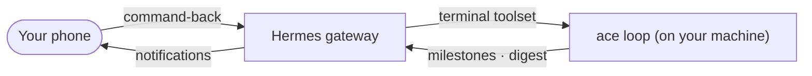

# Remote control — drive ACE from your phone

Watch and steer the autorun loop from any Hermes channel (Signal, Telegram, Discord, …) via [Hermes Agent](https://hermes-agent.org/). Everything here is opt-in and fail-soft: with no `hermes` on `PATH`, all of it is a silent no-op.



Four layers — use as many as you want:

| Layer | Direction | Command | Gives you |
|---|---|---|---|
| Notify | push | `ace hermes` | milestone texts: `started · merged · deployed · CI-red · rathole · stopped` |
| Command-back | pull | `ace hermes` → enable | run any command on the host from chat |
| Service | — | `ace loop …` | the loop as a detachable systemd unit (start/stop from chat) |
| Keep awake | — | `ace awake` | machine stays reachable while you are away |

## Prerequisites

- [Hermes Agent](https://hermes-agent.org/) installed, with a channel bound and authorized **on the Hermes side** (bot token, channel/chat id, allowed users → `~/.hermes/.env` via `hermes gateway`, then restart the gateway). Confirm with `hermes gateway` or a test `hermes send`. This is a Hermes setting, not an ACE one — ACE only picks a target string (`HERMES_TO`). See the ACE-side vs Hermes-side split in [hermes.md](hermes.md).
- `ace` on your `PATH` (the install symlink). The gateway sees it too, as long as `~/.local/bin` is on the gateway's `PATH` (it inherits your user environment).

## Notifications (push)

```bash
ace hermes          # ACE side: saves the target string HERMES_TO (e.g. signal:+15551234567 or telegram:<chat_id>)
```

This only chooses **where** ACE sends — the channel must already be bound and authorized on the Hermes side (see Prerequisites). Then opt in per run: answer **Y** to the Hermes prompt at `ace autorun`, or set `HERMES_NOTIFY=1`. The loop then `hermes send`s you each milestone. Targets are channel-prefixed: `signal:+<E.164>`, `telegram:<chat_id>` (or bare `telegram` = the gateway's home channel), and so on.

## Command-back (pull) — run commands from chat

`ace hermes` can wire this for you, behind a "this grants a host shell — proceed?" confirm. It:

- adds Hermes's `terminal` toolset to your channel, and
- sets `<CHANNEL>_ALLOWED_USERS` to your id, so only you can command the bot.

Once on, you message the bot in plain language and it runs commands on the host:

> "ace loop status" · "tail the loop log" · "restart the myapp loop" · "git -C ~/proj log --oneline -5"

> [!WARNING]
> The `terminal` toolset is a full host shell. The allowlist is your only guard — keep it locked to your id, and keep the gateway's `GATEWAY_ALLOW_ALL_USERS` off (default). Name the project in your message: the bot's shell starts in `~/.hermes`, so "the myapp loop" tells it where to `cd`.

## Run the loop as a service

```bash
ace loop start      # writes .opencode/loop.env, runs the loop as ace-loop.service (detached)
ace loop status     # running? + last heartbeat + last output
ace loop logs       # tail .opencode/last-run.log
ace loop restart    # bounce it (refreshes the unit)
ace loop stop       # SIGTERM → clean-shutdown trap (no orphans)
ace loop update     # git pull ACE + the project, then `ace loop restart` to apply
```

A systemd user service survives terminal-close and sleep, so a chat command can start or stop it cleanly. Bare `ace loop` (no subcommand) stays the interactive launcher; the run-config lives in `<project>/.opencode/loop.env`.

> [!IMPORTANT]
> The service inherits none of your shell env, so `ace loop start` captures the launch-time policy into `loop.env`. Set knobs on the command itself (`HERMES_KANBAN=1 MERGE_APPROVAL=hermes HERMES_TO=signal:+1… ace loop start`), or edit `loop.env` and `ace loop restart`.

### Watch it live — `ace loop dash`

A full-screen truecolor dashboard: the ACE wordmark, a status bar (`cycle · ci · repo · branch · overseer · features`), agent boxes that recolor per state (active / done / idle / fail), and a scrolling log — all read live from the loop's own files (`loop-state.env` · `last-run.log` · `.agents`). Run it in a second terminal or pane next to a running loop; it watches, it does not drive.

| Key | Action |
|---|---|
| `q` | quit the view |
| `p` | pause / resume the view |
| `x` | kill the loop and its opencode subtree, then quit |

`ace loop dash --demo` plays a scripted cycle so you can see it without a live loop.

> [!NOTE]
> The grid lights the agents the loop can observe — orchestrator · implementer · verifier · conflict. The critics run inside opencode's own session, so they show their collective phase, not individually.

### Approve merges from chat (human-in-the-loop)

Launch the loop with `MERGE_APPROVAL=hermes` and it pauses before every merge, messages you the PR title, URL, and a token, and waits:

```bash
MERGE_APPROVAL=hermes ace loop start          # or: MERGE_APPROVAL=hermes ace autorun --yes
ace approve <tok> yes     # release the merge   (ace approve yes = newest pending)
ace approve <tok> no      # leave the PR open and stop
```

An explicit deny, a timeout (`APPROVAL_TIMEOUT`, default 1 h), or no reachable channel all leave the PR open and stop the loop. "No reachable channel" means either no `hermes` binary on `PATH` **or** a `hermes send` that failed (gateway down, bad `HERMES_TO`, channel not authenticated) — the send is tested, and a failure stops the loop straight away with `no usable chat channel` instead of waiting out `APPROVAL_TIMEOUT` for an answer to a question nobody ever saw.

**The gate is deny-by-default.** Only an explicit approval merges:

| Reply | Result |
|-------|--------|
| `yes` `y` `approve` `approved` `ok` `1` `✅` (any casing) | approved — the merge proceeds |
| `no` `n` `deny` `denied` `reject` `rejected` `0` `❌` (any casing) | denied |
| anything else — free text, a typo, an LLM paraphrase | **denied**, with a warning naming the unrecognised word |
| no decision at all (`ace approve <tok>`, or bare `ace approve`) | **error, nothing recorded** — a missing decision is not consent |

The loop is equally strict on the reading side: it approves only on the literal string `yes`, the sole approving value `ace approve` ever writes, so a truncated or partially-written decision file denies.

Without `MERGE_APPROVAL=hermes`, the loop self-merges on green per `AUTOMERGE`, which defaults from the profile's `auto_merge` (env overrides); `AUTOMERGE=0` opens one PR and stops for review. Full round-trip in [hermes.md](hermes.md).

## Stay reachable while away — `ace awake`

You cannot wake a sleeping laptop over chat, so hold it awake before you leave:

| Command | Does |
|---|---|
| `ace awake on` | no idle-sleep / lid-suspend, until `ace awake off` |
| `ace awake on 4h` | auto-releases after 4h (GNU sleep suffix: `30m`, `2h`, …) |
| `ace awake status` | is it holding? shows the live `systemd-inhibit` lock |
| `ace awake off` | release — normal sleep resumes |

This closes the chicken-and-egg problem: the loop's own `systemd-inhibit` only kicks in after it starts, but you need the machine awake to send the start command.

> [!TIP]
> To survive a reboot while logged out, run `loginctl enable-linger`.

## Periodic digest (push, on a schedule)

Use a Hermes cron to post a digest on a schedule — silent unless a loop is running, so no spam. A script under `~/.hermes/scripts/` emits the digest; `--no-agent` delivers its stdout verbatim (no LLM cost):

```bash
# ~/.hermes/scripts/ace-loop-digest.sh  — silent unless ace-loop.service is active
systemctl --user is-active ace-loop.service >/dev/null 2>&1 || exit 0
echo "ACE loop @ $(date '+%H:%M')"; ace loop status 2>/dev/null | head -3

# schedule it (recurring; deliver to your channel)
hermes cron create 'every 30m' --name ace-loop-digest --no-agent \
  --script ace-loop-digest.sh --deliver signal:+15551234567
```

Manage it: `hermes cron list` · `pause` · `resume` · `remove`. Cron requires `cron_mode: allow` in `~/.hermes/config.yaml`. `ace hermes` can register this digest for you.

To schedule a recurring **autorun** (not just a status digest), `ace schedule` is the shortcut — it registers a Hermes cron that (re)starts this repo's loop on your channel:

```bash
ace schedule '0 9 * * 1-5'    # weekday 9am   ·   ace schedule 'every 6h'   ·   ace schedule '30m'
```

## Runbook — fire ACE from Signal while away

Before you leave the machine (awake and reachable):

```bash
ace awake on 8h                                   # stay awake for the day
cd ~/projects/<project>                           # (optional) pre-stage; or let chat cd for you
```

Then, from your phone:

1. "ace loop start in `<project>`" → the bot runs `cd … && ace loop start`; the loop runs as a service.
2. "ace loop status" / "tail the loop log" → watch progress, or rely on the 30-min digest.
3. "ace loop stop" when you are done → clean shutdown.

## Security model

Command-back exposes a host shell over chat. Three controls stand between it and a stranger:

| Control | Setting | Effect |
|---|---|---|
| Per-channel allowlist | `<CHANNEL>_ALLOWED_USERS=<your id>` | only your id can command the bot |
| Gateway-wide allow-all | `GATEWAY_ALLOW_ALL_USERS=false` (default) | strangers are denied |
| Cron gate | `cron_mode: allow` \| `deny` | enables or forbids scheduled/autonomous actions |

> [!WARNING]
> With command-back on, the allowlist is mandatory — it is the only thing between a host shell and anyone who can message the bot. `ace hermes` sets `<CHANNEL>_ALLOWED_USERS` to your id; verify with `ace hermes` or your Hermes config.

> [!CAUTION]
> Never set `GATEWAY_ALLOW_ALL_USERS=true` on a gateway with the `terminal` toolset enabled — it hands a host shell to anyone who can reach the bot. Keep `cron_mode: deny` unless you want the autonomous cron side active.

## Troubleshooting

| Symptom | Cause / fix |
|---|---|
| bot replies but commands "not found" | `ace` not on the gateway's `PATH` — ensure `~/.local/bin` is on it; restart the gateway |
| no notifications | `HERMES_NOTIFY` not set / didn't opt in at `ace autorun`; or `HERMES_TO` unset (`ace hermes`) |
| Signal silent both ways | the `signal-cli` daemon/gateway isn't running — `systemctl --user start signal-cli hermes-gateway` |
| commands rejected from chat | your id isn't in `<CHANNEL>_ALLOWED_USERS` |
| digest never arrives | `hermes cron status` (scheduler running?) · `cron_mode: allow`? · is a loop actually running (the digest is silent when idle)? |

## See also

- [hermes.md](hermes.md) — full Hermes feature reference: notify, approve, schedule, ground, kanban, brain, dashboard
- [autorun.md](autorun.md) — the loop, self-merge, and `AUTOMERGE`
- [configuration.md](configuration.md) — `loop.env`, `HERMES_*`, and `MERGE_APPROVAL`
