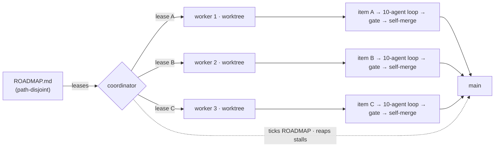

# The swarm — parallel loops

The swarm runs ACE's autonomous loop as N feature-streams at once. Each worker takes one ROADMAP item, works it in its own git worktree, and self-merges to `main`, coordinated so two workers never edit the same files. It is the same loop as [autorun](autorun.md), fanned out.

At a glance:

| | |
|---|---|
| **Run it** | `ace autorun` (pick 2+) · `ace swarm start` · `ace swarm sandbox` (free) |
| **Watch it** | `ace swarm dash` |
| **Stop it** | `ace swarm drain` (finish then stop) · `ace swarm stop` (now, WIP preserved) |
| **Bounded by** | path-disjointness (items sharing a file can't run in parallel) and your model quota (N workers burn it ~N× faster) |

> [!TIP]
> Reach for the swarm when you have more ROADMAP items than you want to wait through serially. On a tight quota, run parallelism `2` rather than the ceiling — N agents reach your usage cap ~N× faster than a single loop.

## Topology



| Node | Role |
|---|---|
| `ROADMAP.md` | source of work; items carry `Files:` hints so the coordinator can lease their true scope |
| coordinator | hands out path-disjoint leases, ticks `ROADMAP.md` after each merge, reaps stalled workers |
| worker N | takes one item, runs the full loop in its own git worktree, self-merges its PR |
| `main` | every worker merges here — but workers never deploy |

## How it works

| Property | Detail |
|---|---|
| **Path-disjoint leasing** | the coordinator only hands a worker an item whose files don't overlap another in-flight item, so merges stay clean. See [conflict-policy](conflict-policy.md). |
| **Self-merge on a local gate** | each worker runs the full [10-agent loop](agents.md) and merges its own PR when `./ci.sh --container` is green (`MERGE_GATE=local`) — no waiting on remote CI |
| **Live cockpit** | `ace swarm dash` shows every worker's stage, active agent, and live feed on one screen |

## Run it

### Through `ace autorun` (recommended)

`ace autorun` asks for parallelism up front:

```
Parallel flows — SWARM (1 = single loop · 2-8 = parallel workers, path-disjoint + self-merging) [1]:
```

| Choice | Result |
|---|---|
| `1` | the classic single-flow [autorun loop](autorun.md) |
| `2`+ | a swarm of that many workers |

The choice is **sticky** — it's saved to `SWARM_MAX` in `~/.config/ace/config.env`, so the next run defaults to it. When you pick ≥2, ACE starts the detached coordinator and drops you into the dashboard.

```bash
ace autorun                     # pick parallelism at the prompt
SWARM_MAX=4 ace autorun --yes   # headless: 4 workers, no prompts
```

> [!NOTE]
> The prompt accepts up to 8, but the coordinator clamps the worker count to `SWARM_CEIL` (default **5**) and logs the clamp. 3–5 is the evidence-backed maximum; past that, coordination and the serialized merge step dominate without a matching speed-up.

### `ace swarm start` (explicit)

```bash
ace swarm start        # detached coordinator (LIVE) + opens the dashboard
ace swarm start fg     # run in the foreground (logs to the terminal, no detach)
```

`start` is **LIVE** — it spends model credits on the real loop. It reads `SWARM_MAX` for the worker count. Set `ACE_NO_DASH=1` to start without auto-opening the dashboard.

### `ace swarm sandbox` (try it free)

```bash
ace swarm sandbox      # DRY run: simulated edits on a throwaway repo — zero credits
```

The sandbox exercises the whole coordination substrate — leases, worktrees, merges, the dashboard, conflict resolution — with simulated edits instead of real agent calls, so you can see how the swarm behaves without spending anything.

> [!IMPORTANT]
> `sandbox` is `DRY_RUN=1`, the default everywhere. `swarm-run.sh` refuses to run the real loop unless `SWARM_LIVE=1 DRY_RUN=0` — a guard against accidentally spending credits. `ace swarm start` and `ace autorun` set both for you; `sandbox` and `selftest` are always DRY.

## Commands

| Command | Does |
|---|---|
| `ace swarm start [fg]` | start the coordinator (LIVE). `fg` = foreground; otherwise detached + opens the dash |
| `ace swarm stop` | stop now — workers claim nothing new, in-flight WIP is committed to their branches |
| `ace swarm dash` | open the live cockpit (alias: `watch`) |
| `ace swarm split` | the cockpit across tmux columns (falls back to `dash` if tmux is absent) |
| `ace swarm pause` | pause all workers — they idle until you resume |
| `ace swarm resume` | clear pause and drain |
| `ace swarm drain` | finish + stop — workers complete the current item, claim no new work, then the swarm stops |
| `ace swarm kill wN` | kill worker N (its in-flight WIP is preserved as a commit) |
| `ace swarm status` | active claims (the MCP `status` tool returns the one-line form) |
| `ace swarm tail [N]` | tail the last N (default 40) coordination events |
| `ace swarm sandbox` | DRY-run demo — zero credits |
| `ace swarm selftest` | run the coordination unit tests (leasing, disjointness, wait) |
| `ace swarm policy` | print the effective conflict-policy table (see [conflict-policy](conflict-policy.md)) |
| `ace swarm wire [check\|apply]` | inspect / apply the per-project swarm wiring (`.gitattributes`, AGENTS protocol) |

## The dashboard — `ace swarm dash`

A self-contained TUI, no tmux required. It reads only the shared store, so you can attach, detach, and re-attach freely, and run several viewers at once.

| Element | Shows |
|---|---|
| status bar | run id · live worker count · roadmap **done / in-flight / remaining** bar · peak concurrency |
| worker box | one per live worker — its feature, the pipeline, the agents strip, wall/budget/lease, and its live loop feed |
| pipeline | `PLAN · BUILD · GATE · REVIEW · MERGE` with the current stage lit `▸…◂`, inferred live from the worker's log so it advances through all stages |
| agents strip | all 9 subagents — `✓` once run, `▸active◂` now, dim while pending (`plan·impl·test·gate·rev·ux·std·algn·rslv`) |
| ⚙ agent | the subagent working right now (reviewer / verifier / implementer …) |
| BUS | cross-worker milestones (claimed · gate · merged · conflict · reaped) |

### Keys

| Key | Action |
|---|---|
| `p` | pause all workers |
| `r` | resume (clears pause **and** drain) |
| `d` | finish + stop — workers complete the current item, claim no new work, then the swarm stops |
| `k` | kill a worker (prompts for `wN`) |
| `x` | **KILL ACE + quit** — SIGTERM the whole swarm (coordinator + workers + opencode), then quit the dash. Prompts `y/N`; in-flight WIP is still committed as WIP on the worker branches |
| `g` | toggle **STACKED** ↔ **PANEL** (a side-by-side grid of worker cells) |
| `+` / `-` | grow / shrink the inline feed height |
| `q` | quit the dashboard — the swarm keeps running (use `d` to stop the swarm) |

> [!NOTE]
> `ace swarm split` lays the cockpit across real tmux columns if you have tmux. Without it, the single-process `dash` gives you the same side-by-side worker cells via the `g` panel layout.

## Graceful control

| You want to… | Do this |
|---|---|
| Pause everything (resumable) | `p` in the dash, or `ace swarm pause` → `ace swarm resume` |
| Wind down — finish in-flight work, then stop | `d` in the dash, or `ace swarm drain` |
| Stop now (preserve WIP) | `ace swarm stop` |
| Kill one stuck worker | `k` in the dash, or `ace swarm kill w3` |
| Kill the whole swarm from the dash | `x` in the dash (prompts `y/N`) |

Every stop path preserves in-flight work: a worker's uncommitted changes are committed to its own `swarm/…` branch (never `main`) with a `WIP:` message, so nothing is lost and a later run can resume it. When all workers finish, the coordinator shuts down cleanly and the dash flips to "no swarm running."

## Per-run archives

Each `ace swarm start` rotates the **previous** run's terminal output — every `wN.log`, the event bus, and the coordinator log — into a datetime-stamped folder, keeping the last `SWARM_ARCHIVE_KEEP` (default 5):

```
~/.config/ace/swarm/<project>/archive/<start-datetime>/
```

These live outside your repo and are never committed — raw material for reviewing a run or improving prompts.

## Rate limits — it waits, never downgrades

If a worker or the coordinator's planning step hits a Claude/OpenAI usage cap, the loop waits for the limit to reset on your chosen model rather than silently swapping to a weaker one — a weaker overseer gives worse plans and reviews. The dash shows `⏳ … usage limit — WAITING for reset`. It rides through a reset window (default 6h), then stops for review; it never auto-downgrades.

> [!TIP]
> To keep going on a weaker model instead of waiting, opt into a DeepSeek fallback per-run with `ON_CLAUDE_LIMIT=deepseek`.

## Safety

| Guarantee | How |
|---|---|
| **Zero-credit by default** | the real loop refuses to run without `SWARM_LIVE=1`; `sandbox` / `selftest` are always DRY |
| **Workers never deploy** | they run with `DEPLOY=0`, so they merge to `main` but never ship. Deploy stays milestone-gated (`DEPLOY_GATE`, see [deploy](deploy.md)) |
| **Full review on auto-merge** | with `auto_merge: true` on a public/customer/enterprise project, the orchestrator's safety rail treats every change as high-risk — the full 4-critic panel plus the security gate — so nothing merges to `main` on a weak review |
| **Predictable conflicts handled up front** | path-disjoint leases plus the [conflict policy](conflict-policy.md) resolve version, changelog, lockfile, and manifest collisions before they happen |

> [!WARNING]
> **Semantic conflicts** — two disjoint-but-interacting merges (green alone, broken together) — are the one gap the swarm doesn't fully guard yet. A serialized rebase-and-re-gate is documented and deferred in [deferred-decisions](deferred-decisions.md). If `main` goes RED right after a concurrent merge, that's the trigger to enable it. Start a real-money project at parallelism `2` and watch the first run.

## Config knobs

All optional — the defaults are tuned. Set them in the environment or `~/.config/ace/config.env`.

| Knob | Default | What it does |
|---|---|---|
| `SWARM_MAX` | `4` | requested worker count (the `ace autorun` prompt sets this) |
| `SWARM_CEIL` | `5` | hard ceiling on workers; a higher `SWARM_MAX` is clamped down and logged (3–5 is the evidence-backed max) |
| `SWARM_LIVE` | `0` | `1` = spend credits on the real loop (set by `ace swarm start` / `autorun`) |
| `DRY_RUN` | `1` | `1` = simulated edits, zero credits (sandbox); `0` = real |
| `SWARM_SYNC` | `1` | run the OBJECTIVES→ROADMAP planning sync at start; `0` to skip |
| `SWARM_ARCHIVE_KEEP` | `5` | how many past runs' logs to retain under `archive/` |
| `SWARM_MAX_TRIES` | `3` | park an item after this many failed attempts |
| `SWARM_LEASE_TTL` | `900` | seconds a silent worker holds its lease before it's reclaimed |
| `SWARM_BEAT` | `30` | worker heartbeat interval (seconds) |
| `SWARM_WATCH` | `0` | `1` = surface waiting / blocked / conflict events to Hermes / Telegram |
| `SWARM_MAIN` | `main` | the branch workers merge into |
| `SWARM_REPO` | *cwd repo* | the project repo (defaults to the current git root) |
| `SWARM_DIR` | `~/.config/ace/swarm/<slug>` | the coordination store (state, logs, worktrees, archives) |
| `SWARM_META_FREE` | *ROADMAP / OBJECTIVES / …* | files never leased per-item (coordinator-ticked / union-merged) |
| `SWARM_SIM_DELAY` | `0` | sandbox-only: hold each lease this long so concurrency is visible |
| `ACE_NO_DASH` | `0` | `1` = don't auto-open the dashboard after `start` |
| `CREDIT_REVIEW` | `1` | credit review / reconcile / merge time off the per-item budget (like builds); `0` to charge it |

See [configuration](configuration.md) for the loop-wide knobs (`MERGE_GATE`, `AUTOMERGE`, `DEPLOY`, timeouts) that apply to each worker too.

## Troubleshooting

| Symptom | Cause / fix |
|---|---|
| "swarm already running" | a coordinator for *this* project is live — `ace swarm stop`, then start. It's scoped per-project, so it won't block a different repo |
| dash shows 0 workers but a worker is running | the store self-heals a corrupt `state.json`; the dash also falls back to `status/*.stat`. If it persists, `ace swarm stop && ace swarm start` |
| pipeline stuck on BUILD | fixed — the stage is inferred from the live log. Make sure `scripts/auto-loop.sh` is the current thin wrapper (`ace upgrade`, or re-scaffold) |
| all workers grabbed the same item | a symptom of a corrupt store (now auto-repaired). Stop + start to reset |
| `ace swarm split` opens the single dash | tmux isn't installed — the single-process `dash` + `g` panel is the no-tmux equivalent |
| burning quota too fast | drop parallelism (`ace autorun` → `2`), let it wait on the cap (default), or opt into `ON_CLAUDE_LIMIT=deepseek` |

## See also

- [autorun.md](autorun.md) — the single-flow loop the swarm fans out
- [agents.md](agents.md) — the 10-agent crew each worker runs
- [conflict-policy.md](conflict-policy.md) — how predictable merge conflicts are handled
- [deferred-decisions.md](deferred-decisions.md) — the serialized-merge re-gate, and why it's deferred
